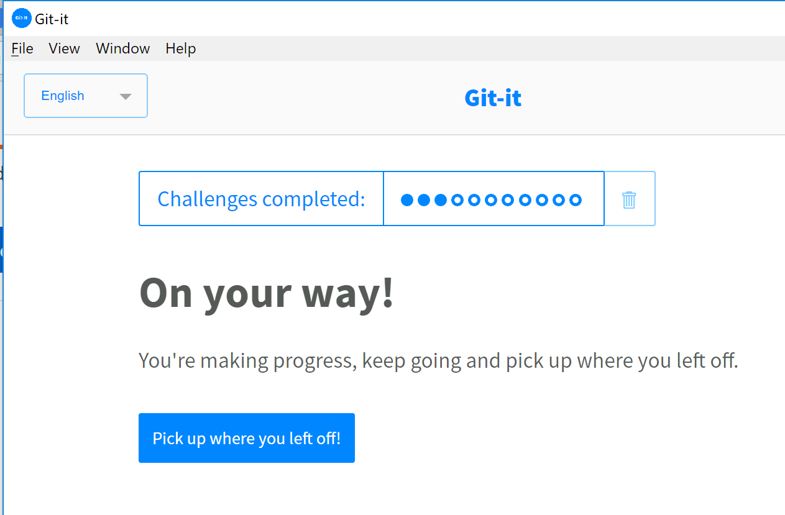

# Repo for the git-it excercise

This is a guided git and github tutorial. It is using the [git-it] desktop app by @jlord for a [software engineering course].

(You start it by using a github classroom invitation from the course materials site).

### Instructions

- Downlad and install the git-it app from [git-it downloads] (direct link to a specific [windows version])
- Start the app and follow all tutorial steps, verifying each one.
- Upon finishing, update the readme with:
  - Your details below.
  - Two screenshots (instead of the ones below), one showing that all the steps were verified (push the app title to get to this screen),and the other showing that you are a contributer to the tutorial repository, make sure to link to **your** images.
 - Commit and push these changes to your private github repository until the deadline. 

### Submission details:

- Personal excercise: HW3 - version control with Git
- Name:
- ID#
- github username:
- Estimation of hours I worked on it:

Comments and wishes concerning this excercise:

#### Screenshots

Good luck!

#### Other interesting tutorials:

1. https://try.github.io
1. http://gitimmersion.com
1. https://pcottle.github.io/learnGitBranching/
1. https://services.github.com/training/

<!-- Links -->
[software engineering course]: https://github.com/jce-il/se-class/wiki
[git-it]: https://github.com/jlord/git-it-electron
[git-it downloads]: https://github.com/jlord/git-it-electron/releases
[windows version]: https://github.com/jlord/git-it-electron/releases/download/4.3.3/Git-it-Win-ia32.zip